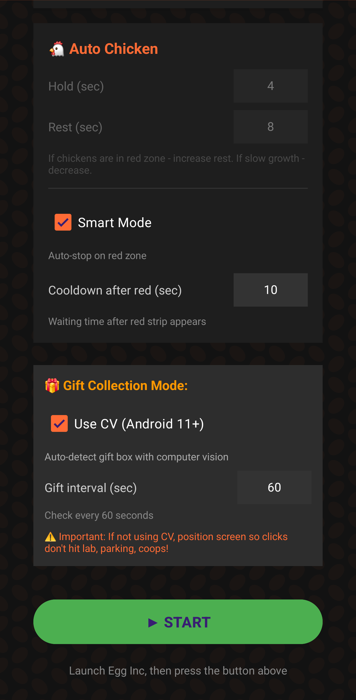
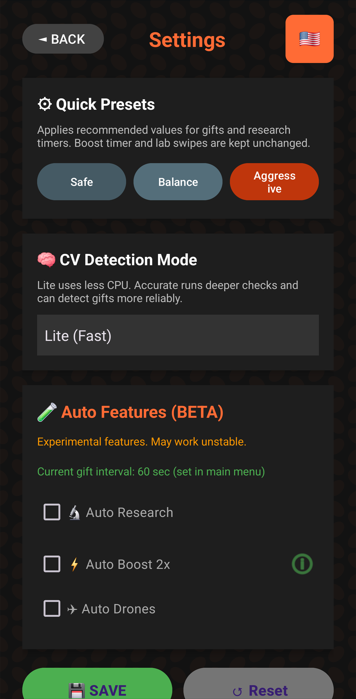
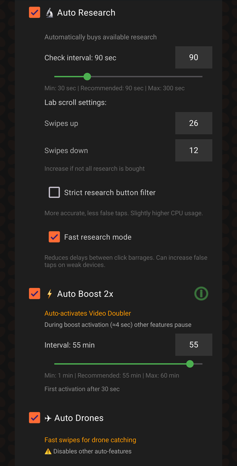

# AutoEgger

  
  

  

Android-приложение для автоматизации рутины в **Egg Inc**  
Основной фокус это максимально автоматизировать все рутинные задачи, чтобы можно было спокойно оставить телефон на ночь и наслаждаться на следующее утро карманами, полными яиц.

## Ключевые моменты

- Адаптивное поведение для разных экранов и соотношений сторон
- CV-автоматизация для подарков и исследований
- Оверлей с независимыми авто-функциями

## Важно

Проект активно дорабатывался с помощью ИИ.  
Если хотите продолжить развитие или сделать лучше, пожалуйста, создайте форк и ведите изменения в своём репозитории.

Поток разрешений на Android 13+:
1. Выдайте Overlay.
2. Откройте Accessibility и один раз нажмите сервис `Egg Inc Autoclicker` (чтобы появилось предупреждение restricted settings).
3. Откройте настройки приложения, нажмите `⋮` (справа сверху), выберите `Allow restricted settings`.
4. Вернитесь в Accessibility и включите сервис.

## Совместимость

### Минимальная поддержка
- Android 7.0+ (API 24+)
- Разрешение на оверлей
- Включённый Accessibility Service

### Рекомендуется
- Android 11+ для CV-сценариев
- Android 13+ после включения restricted settings для Accessibility

### Проверенные устройства
- Samsung S24 Ultra (реальное устройство: тесты в 4K и 1560x720 (HD+))
- Эмулятор телефона в Android Studio (малое разрешение)
- Эмулятор планшета в Android Studio (широкий экран)

## Возможности

- `Авто-курицы`: обычный и умный режим (пауза при красной зоне)

- `Авто-подарки`: CV-поиск объекта + таймерный режим

- `Авто-исследования`: поиск зелёных кнопок, свайпы, интервал

- `Авто-буст 2x`: автоприменение Video Doubler по интервалу

- `Авто-дроны`: свайповый режим ловли

## Скриншоты

Главный экран:

Экран настроек:

Панель авто-функций (развёрнута):

## Быстрый старт

1. Установите APK из [Releases](https://github.com/Stepmaster12/AutoEgger/releases).
2. Выдайте приложению разрешения (оверлей + accessibility).
3. Откройте настройки и проверьте интервалы/режимы.
4. Запустите оверлей и нажмите `START`.

## Дисклеймер

Использование на ваш страх и риск. Ну вы и так знаете, чё мне об этом говорить.

## Структура проекта

- `app/src/main/java/com/egginc/autoclicker/`  
  Основной код приложения (UI, сервисы, логика автоматизации).
- `app/src/main/java/com/egginc/autoclicker/service/`  
  Сервисы выполнения и раннеры автоматизации.
- `app/src/main/java/com/egginc/autoclicker/cv/`  
  CV-хелперы для детекта объектов.
- `app/src/main/res/`  
  Layout, строки, drawables и локализация.

## Технологии

- Kotlin + Android SDK
- Accessibility Service + Overlay window
- Лёгкий bitmap/template CV-детект (без OpenCV runtime зависимости)
- Coroutines для фоновых задач

## Лицензия

MIT. См. [LICENSE](./LICENSE).

